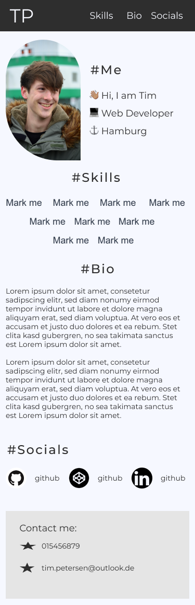

# personal-website
This is a project during my studies @NeueFische to showcase not just a project but rather myself

## Goal
- Design a Websiite using Figma before writing a single line of code
- Create a Website using Html, Css & JS only
- Build mobile first
- Build a clean Html structure & add non-semantic elements later
- Code one clean css sheet with a good structure & minimal duplicates 

## Figma Design Showcase

## Result
### Page showcase
- This page is live via vercel. Click the link in the upper right corner to access the page

#### Page look & feel showcase
- Coming soon

#### Personal highlight
- Coming soon

## Tools & Libraries used
- Only plain Html, Css and a bit JS for some animations

## Learnings
- Scss is a blessing
- Writing only semantic Html first and adding non-semantic elements later results in a better structured Markup
- First use case for real cross-browser-support issues with "Width: fit-content"
- Creating a design first accelerates the whole building process a lot
- Building mobile first is way easier than building desktop/tablet-first

### New:
- Some new tags for html e.g. `<picture>`

## Next Steps
- Expand the Website with content (e.g. Portfolio)
- Follow the IT-Bootcamp @NeueFische wherever it goes
